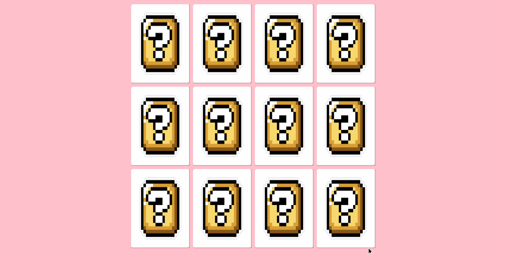

  #  Jogo

 

# Sobre o Projeto 
Este é um projeto do Bootcamp React Web Developer   feito na [
Digital Innovation One](https://web.digitalinnovation.one/track/everis-fullstack-developer?tab=path) cujo o objetivo foi criar um jogo da memória, nesse projeto foi abordado o HTML, CSS ,Javascript e efeitos 3D no CSS .
 
Com a instrutora  [@Gabriela Pinheiro](https://www.linkedin.com/in/gabrielapinheiro129/) .

**Aprendizado**

Consegui aumentar as minhas habilidades relacionados ao  HTML, CSS ,Javascript e aprendi um pouco sobre efeitos 3D no CSS .

## Antevisão 💻📱
  

 

## Licença 📝 

 Este projeto está sob a licença MIT.CLique <a href=https://github.com/Rafael-Yokoyama/Bootcamp-React-Web-Develope/blob/master/LICENSE> aqui </a> para saber mais 
  
 
  
  Este projeto foi desenvolvido com 💗 por  <a href="https://github.com/Rafael-Yokoyama"> @RafaelYokoyama </a> 
  
 

